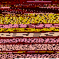

# txt--img


Allows convert UTF-8 based text as png image and back. Not very useful. Made completely for fun.

## Requirements

- **Ruby** interpreter `>= v2.3.3`
- **imagemagick** `>= v7.0.7`

Make sure given executables are available in your environment's shell:

- `ruby` for `test.rb`, otherwise you can to ignore it and run your Ruby like u want
- `magick` for Windows or `convert` for others OS (you can change it on beginning of `img2txt.rb` and `txt2img.rb` files for custom path of imagemagick)

## Getting Started

To use both scripts you need to enter input file and output file path and that's all

```
ruby img2txt.rb <input> [<output>]
ruby txt2img.rb <input> [<output>]
```

By default, the value of output is equal to the value of input with changed extension.

## Results of tests

Width and height of image is a square root of (characters + 1) rounded up.

command | input | output
:------:|:-----:|:------:
`txt2img`| [sample.txt](test/sample.txt) | 
`img2txt`|  | [result.txt](test/result.txt)

## Performance

`txt2img` haven't the best performance. It calls for draw each >512 pixels at once. A better option would be to create a PNG file on the fly by a Ruby script (a bit of unnecessary work) or by hooks imagemagick's shared libraries with FFI (but it was an option less convenient to write).

Last pixel of every image is an END-OF-TEXT character (U+0003). It's better than reading every empty pixel before finish. In truth, `img2txt` rejects blank pixels (empty characters in UTF-8 do not exist), so this character is as good as unnecessary. It has been added for larger files.
